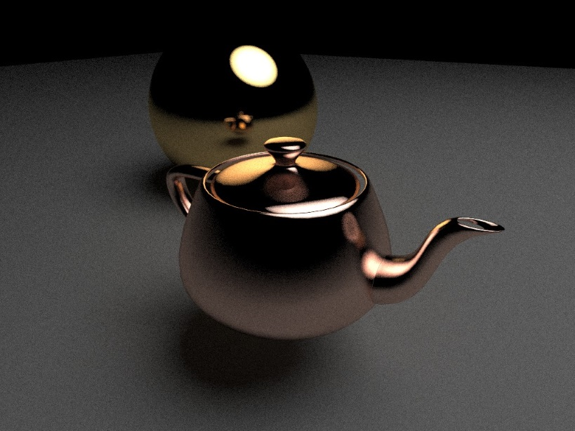
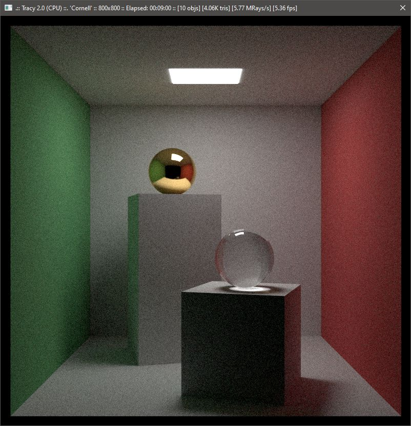
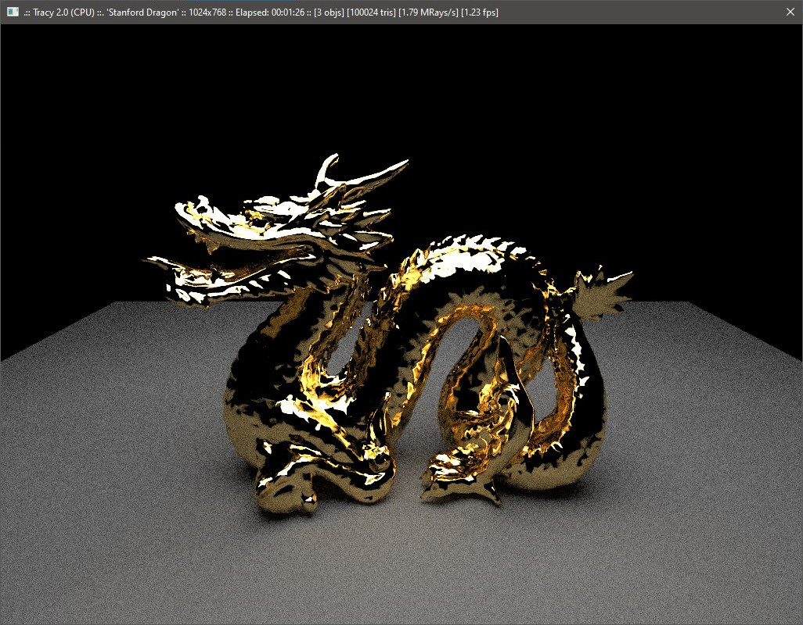
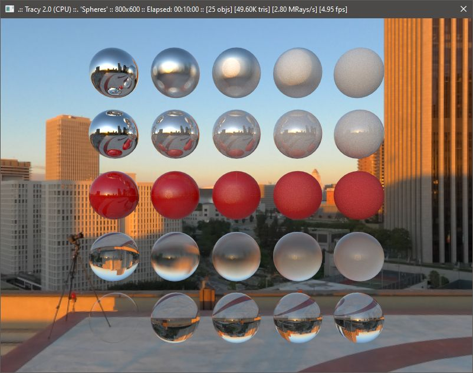
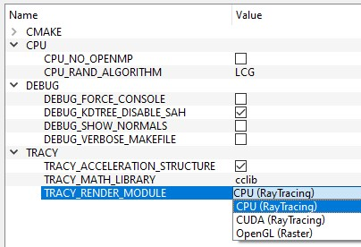

# Tracy  

A simple raytracer based on *"Raytracing in One Weekend"* series by P. Shirley, you can find it [here](https://www.amazon.com/dp/B01B5AODD8) or [here](https://raytracing.github.io/books/RayTracingInOneWeekend.html).

Mostly useful as profiling and optimization bench. I also used this project to start coding my own util functions / math library and to play with OpenMP and CUDA.

Tracing keep going as background task and image will keep getting better (with more samples) over time.
Camera can be moved in realtime using ``W``, ``A``, ``S``, ``D``, ``Q``, ``E`` keys and mouse (FPS-style).

Tracy only deals with triangle meshes (even builtin shapes like sphere or box are procedurally generated as triangle meshes) and uses a BVH/KdTree structure to speed up collision tests. ``data/scenes`` contains some simple and heavily commented scene description files. Scene file path can be specified as parameter. When started with no parameters Tracy tries to read ``data/default.scn``.

Tracy material parametrization is *Unreal-ish*, with the usual *roughness* and *metalness* controlling metals and dielectrics and *translucent, IOR* parameters used for translucent materials. Here are the usual spheres collection:

  - 1st row shows metal spheres with roughness going from 0 to 1
  - in 2nd row spheres drop their metalness from 1 to 0
  - 3rd row shows a dielectric with its roughness growing from 0 to 1
  - 4th row shows a translucent object with a IOR of 1.5 and roughness ranging from 0 to 1
  - last row shows again translucent objects with different IORs, going from 1 to 2

Finally Tracy supports textured meshes and HDR sky probes, as shown in the following *wonderful* proof-of-concept animation:

### Building

Tracy uses CMake to handle different modules and dependencies. It defaults to the standard CPU raytracer with no external dependencies and (hopefully) sensible defaults.

