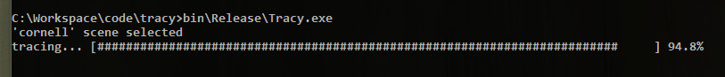
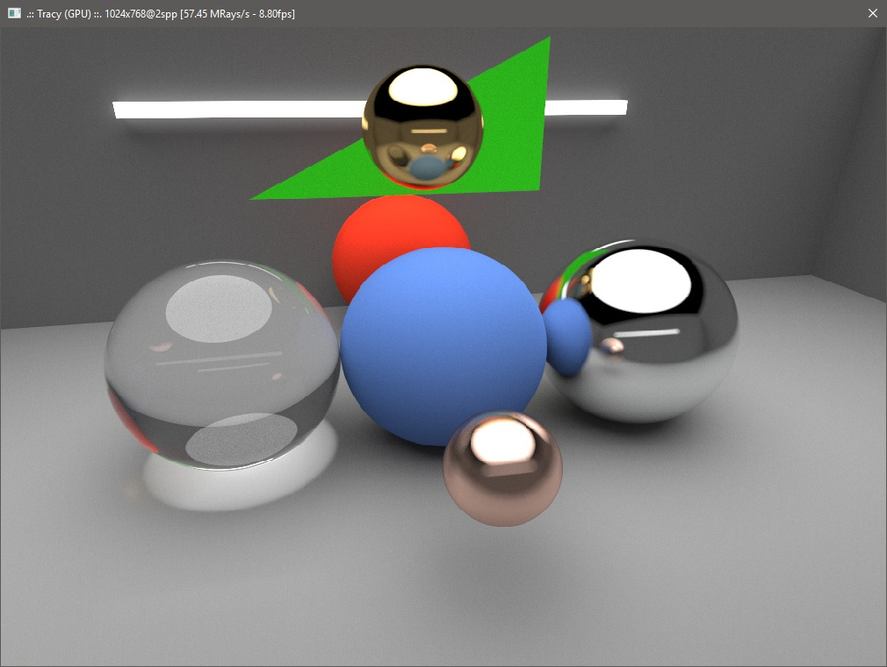
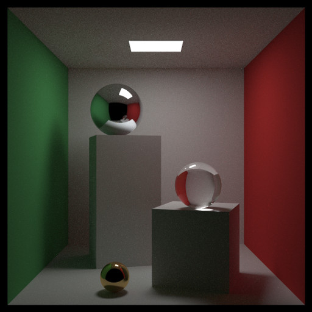
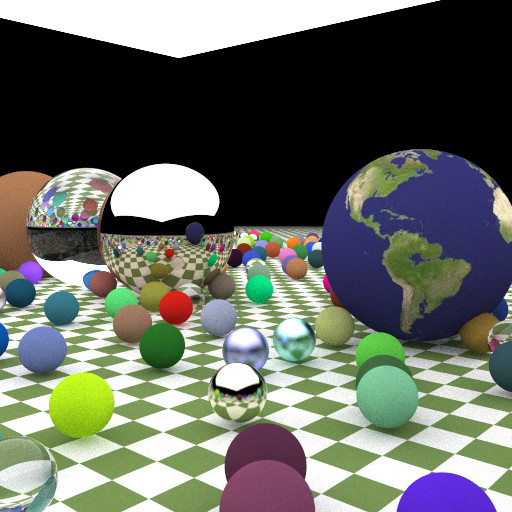
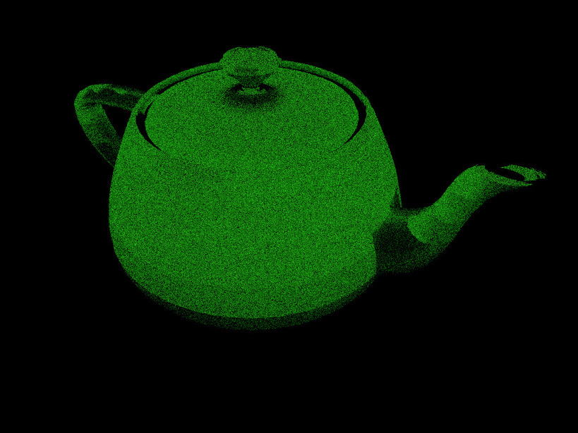

# Tracy 

A simple raytracer based on *"Raytracing in One Weekend"* series by P. Shirley ([Link](https://www.amazon.com/dp/B01B5AODD8)).
Mostly useful for profiling and optimization tests.

It gave me the excuse i needed to start my own util functions / math library and to play with OpenMP. ~~CUDA is coming next.~~ A very simple CUDA implementation is also present.

Tracing is ~~not yet~~ visible in realtime if you build with ``USE_GUI`` (only on Windows ATM), ~~but i added~~ either way a cute progress bar ~~so you can~~ will help you estimate how many coffees you can drink before work has finished.

When GUI version is used tracing will continue in background and image will keep getting better over time. ``S`` key will save a screenshot.

This is an example of CornellBox tracing (1500 samples per pixel). I added some spheres with different
materials to make result more interesting:

This is another scene inspired by one of those present in minibook (500 spp) showing different materials and textured objects:

Now Tracy is able to render triangle meshes ~~(cpu version only)~~. Coming next: ~~extension to gpu code,~~ optimization using a decent BVH implementation.

